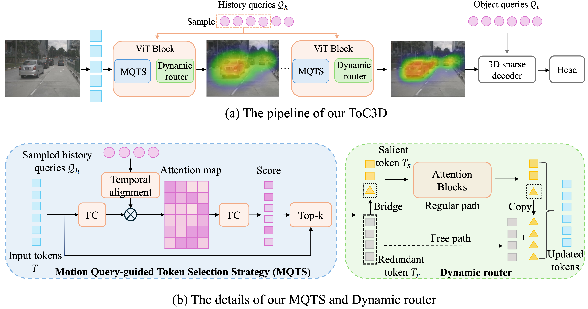
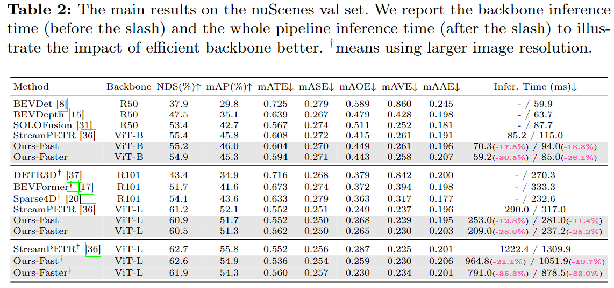

<div>

</div>

# ToC3D: Make Your ViT-based Multi-view 3D Detectors Faster via Token Compression

<div align="center">

[Dingyuan Zhang](https://github.com/DYZhang09) <sup>1,* </sup>,
[Dingkang Liang](https://github.com/dk-liang) <sup>1,* </sup>,
[Zichang Tan](https://orcid.org/0000-0002-8501-4123) <sup>2</sup>,
[Xiaoqing Ye](https://shuluoshu.github.io)  <sup>2</sup>,
[Cheng Zhang](https://orcid.org/0000-0001-6831-5103) <sup>1</sup>,
[Jingdong Wang](https://jingdongwang2017.github.io) <sup>2</sup>,
[Xiang Bai](https://xbai.vlrlab.net) <sup>1,✉</sup>
<br>
<sup>1</sup> Huazhong University of Science and Technology,
<sup>2</sup> Baidu Inc.
<br>
\* Equal contribution, ✉ Corresponding author.
<br>

[](https://arxiv.org/abs/2409.00633)
[](https://www.apache.org/licenses/LICENSE-2.0)

</div>

This repository represents the official implementation of the paper titled "Make Your ViT-based Multi-view 3D Detectors Faster via Token Compression".

By leveraging history object queries as
foreground priors of high quality, modeling 3D motion information in
them, and interacting them with image tokens through the attention
mechanism, ToC3D can weigh more computing resources to important foreground tokens while compressing the information loss, leading to a more efficient ViT-based multi-view 3D detector




## 🛠️ Getting Started

This project is built upon StreamPETR, and the preparations are rougly follow the StreamPETR.

### Environment Setup
1. Follow the [StreamPETR setups.](https://github.com/exiawsh/StreamPETR/blob/main/docs/setup.md)
2. Install the [timm](https://github.com/huggingface/pytorch-image-models) and [detectron2](https://github.com/facebookresearch/detectron2).

We use the following environment:
```shell
torch                     1.10.1+cu111             
torchvision               0.11.2+cu111
mmcls                     0.25.0                   
mmcv-full                 1.6.0                    
mmdet                     2.28.2                   
mmdet3d                   1.0.0rc6                 
mmsegmentation            0.30.0                   
timm                      0.9.7                    
```

### Data preparation
Exactly the same as the [StreamPETR data preparation.](https://github.com/exiawsh/StreamPETR/blob/main/docs/data_preparation.md) After the preparation, the data folder should look like:

```shell
data/
├── nuscenes
│   ├── maps 
│   ├── nuscenes2d_temporal_infos_train.pkl
│   ├── nuscenes2d_temporal_infos_val.pkl
│   ├── samples
│   ├── sweeps
│   └── v1.0-trainval
```

### Pretrained weights
As the baseline is trained with EVA-02 petrained weight, here we need to prepare the weights.

Following the instructions from [StreamPETR](https://github.com/exiawsh/StreamPETR/blob/main/docs/ViT_Large.md#pretrain-weights) to download the object365 weights and transform the weights. Finally put the weights into the ```ckpts/``` folder:
```shell
ckpts/
└── eva02_L_coco_det_sys_o365_remapped.pth
```


## 💾 Training logs and official weights
**Note: the performance of trained models will be influenced by the environments and machines. So we provide our training logs and weights here.**
| Model     | Logs | Weight|
| ----------- | :-----------: | :-------: |
| ToC3D_fast    | [ToC3D_fast.log](training_logs/ToC3D_fast.log)       |  [OneDrive](https://1drv.ms/f/s!Ajd0iyiSnYweg4FnrHhsVMnD-pRcOg?e=YCipe0) |
| ToC3D_faster  | [ToC3D_faster.log](training_logs/ToC3D_faster.log)        | [OneDrive](https://1drv.ms/f/s!Ajd0iyiSnYweg4FnrHhsVMnD-pRcOg?e=YCipe0) |
| ToC3D_fast (1600 resolution) | [ToC3D_fast_1600.log](training_logs/ToC3D_fast_1600.log) | [OneDrive](https://1drv.ms/f/s!Ajd0iyiSnYweg4FnrHhsVMnD-pRcOg?e=YCipe0) |
| ToC3D_faster (1600 resolution) | [ToC3D_faster_1600.log](training_logs/ToC3D_faster_1600.log) | [OneDrive](https://1drv.ms/f/s!Ajd0iyiSnYweg4FnrHhsVMnD-pRcOg?e=YCipe0) |

## 🚀 Inference
The basic commands are the same as the [StreamPETR.](https://github.com/exiawsh/StreamPETR/blob/main/docs/training_inference.md)

### 📋 Evaluate ToC3D-Fast and ToC3D-Faster
Run the following command:

1. ToC3D-Fast & ToC3D-Faster
    ```shell
    ./tools/dist_test.sh projects/configs/ToC3D/ToC3D_fast.py <ckpt> <num_gpus> --eval mAP  # Fast version

    ./tools/dist_test.sh projects/configs/ToC3D/ToC3D_faster.py <ckpt> <num_gpus> --eval mAP  # Faster version
    ```
    where ```<ckpt>``` is the path of the checkpoint and ```<num_gpus>``` is the number of gpus used for inference.

2. High input resolution (1600 x 800)
    ```shell
    ./tools/dist_test.sh projects/configs/ToC3D_1600_resolution/ToC3D_fast_1600.py <ckpt> <num_gpus> --eval mAP  # Fast version

    ./tools/dist_test.sh projects/configs/ToC3D_1600_resolution/ToC3D_faster_1600.py <ckpt> <num_gpus> --eval mAP  # Faster version
    ```

### 🚄 Speed test
To accurately measure the inference speed, we first warmup the model with 200 samples and then calculate the inference time.

Run the following command:
```shell
./tools/dist_test.sh projects/configs/test_speed_ToC3D/stream_petr_eva_vit_l.py <ckpt> 1 --eval mAP  # baseline (StreamPETR)

./tools/dist_test.sh projects/configs/test_speed_ToC3D/ToC3D_ratio755.py <ckpt> 1 --eval mAP  # Fast version

./tools/dist_test.sh projects/configs/test_speed_ToC3D/ToC3D_ratio543.py <ckpt> 1 --eval mAP  # Faster version
```

### 👀 Visualization
Run the following command:
```shell
./tools/dist_test.sh projects/configs/token_vis_ToC3D/ToC3D_fast.py ckpts/<ckpt> 1 --eval mAP   # Fast version

./tools/dist_test.sh projects/configs/token_vis_ToC3D/ToC3D_faster.py ckpts/<ckpt> 1 --eval mAP   # Faster version
```

The visualization results will be saved at ```token_vis/``` by default. You can specify the number of visualized samples, visualization samples id and output path by changing the config like:
```python
model = dict(
    type='Petr3D',
    ...
    vis_num_sample = <number of samples>,
    vis_start_id = <id of the first sample>,
    vis_out_path = <output path>,
    ...
)
```

## 🏋️ Training 
The basic commands are the same as the [StreamPETR.](https://github.com/exiawsh/StreamPETR/blob/main/docs/training_inference.md)

Our training pipeline contains the following steps:

1. Train the official StreamPETR as the pretrained model.

2. Apply our method to the StreamPETR and then finetune the model with pretrain weights loaded.

### StreamPETR training
1. Train the StreamPETR with ViT-L (load EVA-02 pretrained weights):
    ```shell
    ./tools/dist_train.sh projects/configs/StreamPETR/stream_petr_eva_vit_l.py 8 --work-dir <path to your work dir>

    ./tools/dist_train.sh projects/configs/StreamPETR/stream_petr_eva_vit_l_1600.py 8 --work-dir <path to your work dir>  # higher input resolution (1600 x 800)
    ```

2. Find the weights in ```<path to your work dir>```, rename to ```streampetr_eva_vit_l_48e.pth``` (```streampetr_eva_vit_l_1600_24e.pth``` for higher input resolution version) and put it into the ```ckpts/``` folder.

### Baseline training
Since our method are finetuned based on StreamPETR, **we also directly finetune the StreamPETR without ToC3D for a fair comparison**:

```shell
./tools/dist_train.sh projects/configs/baseline_finetuned/stream_petr_eva_vit_l_finetuned.py 8 --work_dir <path to your work dir>

./tools/dist_train.sh projects/configs/baseline_finetuned/stream_petr_eva_vit_l_1600_finetuned.py 8 --work_dir <path to your work dir>  # higher input resolution
```

### ToC3D training
Run the following command:

```shell
./tools/dist_train.sh projects/configs/ToC3D/ToC3D_fast.py 8 --work-dir <path to your work dir>  # Fast version
./tools/dist_train.sh projects/configs/ToC3D/ToC3D_faster.py 8 --work-dir <path to your work dir>  # Faster version
```

For higher input resolution, run:
```shell
./tools/dist_train.sh projects/configs/ToC3D_1600_resolution/ToC3D_fast_1600.py 8 --work-dir <path to your work dir>  # Fast version

./tools/dist_train.sh projects/configs/ToC3D_1600_resolution/ToC3D_faster_1600.py 8 --work-dir <path to your work dir>  # Faster version
```

## 📈 Results on NuScenes Val Set.
**Note: the performance of trained models will be influenced by the environments and machines. So we provide our training log and weights.**
<div align="center">
  
</div><br/>

## 🎯 TODO

- [X] Release Paper
- [X] Release Code
- [X] Release logs
- [X] Release weights

## ❛❛❞ Citation
```bibtex
@article{zhang2024makevitbasedmultiview3d,
      title={Make Your ViT-based Multi-view 3D Detectors Faster via Token Compression}, 
      author={Dingyuan Zhang and Dingkang Liang and Zichang Tan and Xiaoqing Ye and Cheng Zhang and Jingdong Wang and Xiang Bai},
      booktitle={European Conference on Computer Vision},
      year={2024},
}
```

## ❤️ Acknowledgements

We thank these great works and open-source codebases:
[MMDetection3d](https://github.com/open-mmlab/mmdetection3d), [StreamPETR](https://github.com/exiawsh/StreamPETR?tab=readme-ov-file), [Dynamic ViT](https://github.com/raoyongming/DynamicViT/tree/master), [Evo-ViT](https://github.com/YifanXu74/Evo-ViT).
